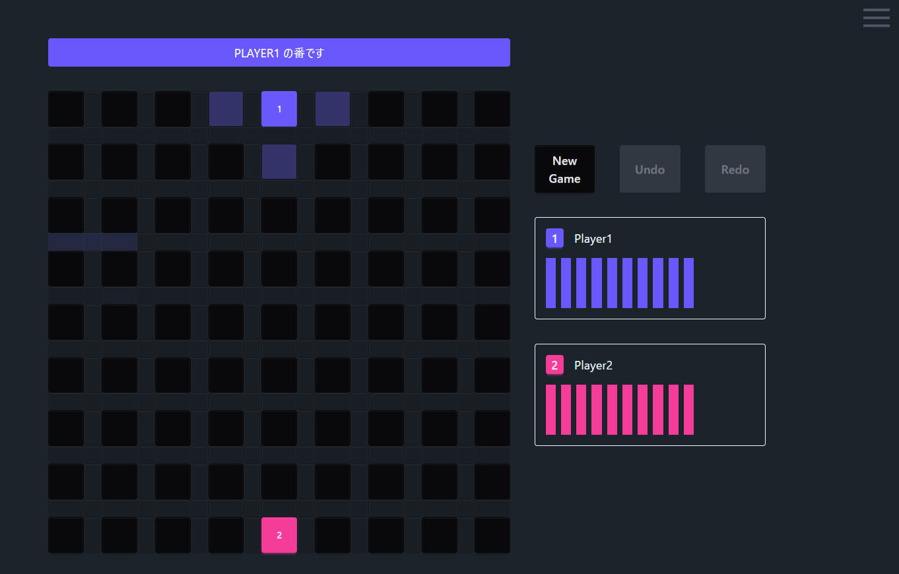
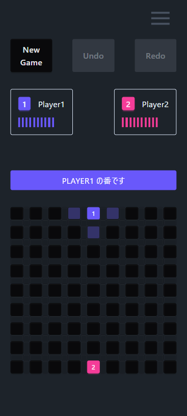

# コリドール・オンライン

## 概要
コリドール・オンラインは、戦略的なボードゲーム「コリドール」をあなたのPCもしくはスマートフォンで楽しむためのアプリです。プレイヤーは壁を配置して相手の進路を妨害しながら、自分の駒をゴールに導くことを目指します。シンプルなルールながら、奥深い戦略性が求められるゲームです。

## 画面イメージ

    

        <h3>PC</h3>
        
    

    

        <h3>スマホ</h3>
        
    

## ルール
- 各プレイヤーは自分の駒を持ち、スタート地点からゴール地点を目指します。
    - ゴール地点はスタート地点と反対側の行(一番上 or 一番下の行)です。
    - 先にゴール地点に到着したプレイヤーが勝者となります。
- プレイヤーは交互に駒を1マス移動させるか、壁を1枚配置します。
    - 壁は各プレイヤー**10枚まで**配置できます。
    - 壁はボード上に配置された他の壁と重ならないように配置しなければなりません。
    - 壁は相手がゴールできなくなるように配置することはできません。
    - プレイヤーの駒は壁を飛び越えることはできませんが、相手の駒を飛び越えることはできます。

## 仕様技術

    
    
    

## 今後の改善
- プレイヤー名を変えられるようにする
- 駒の色を選べるようにする
- AIと対戦できるようにする
- 勝敗記録をつけられるようにする